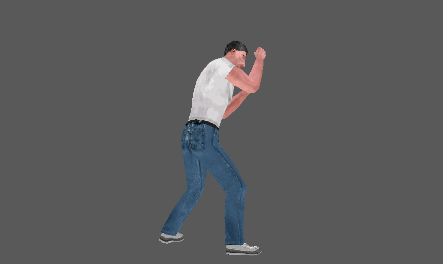
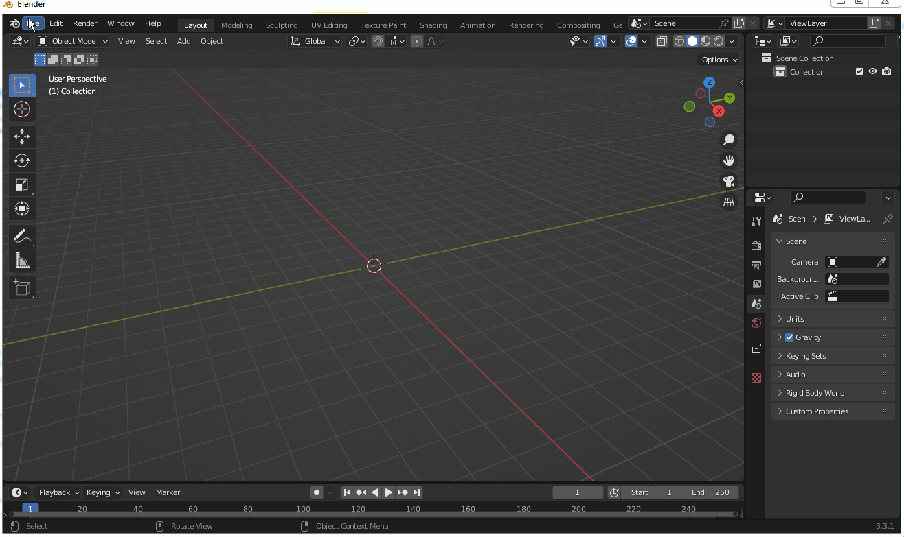

# Описание

Форматы и плагины для просмотра файлов игры Месть боксера. Московский криминалитет. Описание форматов в шаблонах .bt для программы 010Editor.

****Задачи:****
- [x] Плагин BLENDER для просмотра BHM файлов
- [ ] Плагин BLENDER для просмотра MS3d файлов
- [ ] Плагин BLENDER для экспорта файлов в игру

Say hi to boxer.

    

    

## Игры

**1. Месть боксера. Московский криминалитет (2006)**

**Форматы** 

| № | Формат файла       | Шаблон (010Editor)     | Прогресс     |   Описание |
| :--- | :--------- | :----------- | :---------- | :---------- | 
| 1 | .bhm        | [BHM.bt](https://github.com/AlexKimov/afs-file-formats/blob/main/formats/templates/010editor/BHM.bt)        | **99%**      |            персонажи  |
| 2 | .ms3d        | [MS3D.bt](https://github.com/AlexKimov/afs-file-formats/blob/main/formats/templates/010editor/MS3D.bt)        | **90%**      |             уровни |

    Формат bhm - модель персонажа с вершинной анимацией
    Формат ms3d - модель локации уровня, отдельно хранятся модели для света.

**Плагины**

| № | Плагин       | Программа | Описание |  
| :--- | :--------- | :----------- | :---- | 
| 1 | [io_scene_boxers_revenge_bhm](https://github.com/AlexKimov/afs-file-formats/blob/main/plugins/blender/io_scene_boxers_revenge_bhm/__init__.py) | Blender > 2.8 (проверено на 3.3) | Плагин для просмотра файлов моделей bhm с анимацией |

****Как установить Blender плагин****

    1. Скопировать папку с плагином в папку Blender - x.x - scripts - addons....
    2. Запустить Blender, зайти в настройки (клавиши Ctrl + Alt + U или в меню Edit-Preferencies).
    3. В списке слева выбрать addons, сверху выбрать Testing, найти плагин в списке и активировать его на квадрат.
    4. Открыть .bhm файл через меню **File-Import**, справа в поле настроек можно написать название текстуры, чтобы плагин сам загрузил текстуру, 
       она должна быть в одной папке с файлом .bhm, если нет, то зайти в Shader Editor и задать файл вручную.

