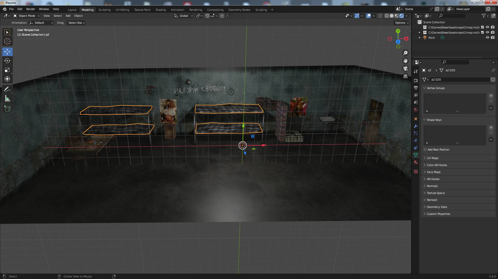
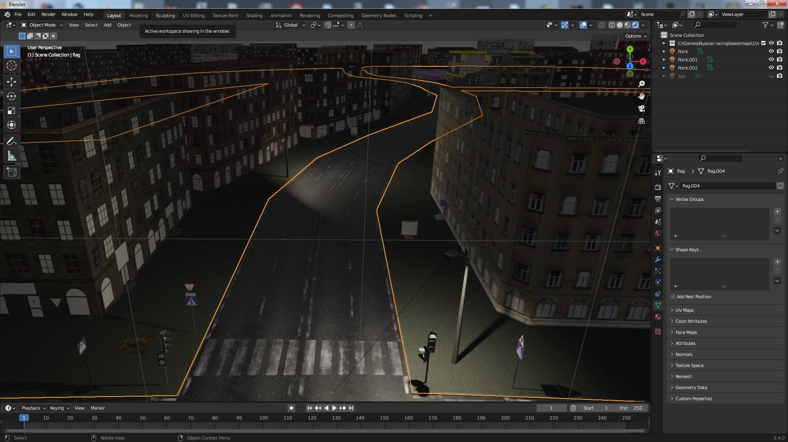

# Описание

Форматы и плагины для просмотра файлов игр от Alligator Friends Software, Bug Hunter Software, 7 Stars Software. Описание форматов в шаблонах .bt для программы 010Editor.  
Список некоторых игр [1](https://www.old-games.ru/catalog/?developerCompany=2641), [2](https://www.old-games.ru/catalog/?developerCompany=4228) .

### Краткое введение в форматы файлов

**Форматы для моделей и текстур**  
  Во всех играх (или большинстве) от разработчиков используется один и тот же набор форматов: MS3D хранит уровни и транспорт, BHM для моделей людей.
 
### Вопросы/Ответы  
1. Как достать модели из игры Месть боксера? Как вытащить уровни из игры Месть боксера? Как открыть файл .ms3d и .bhm?  
   Использовать плагины для Blender ([ссылка](#blender)). Поддерживаются старые версии программы (~3.3), модели загружаются вместе с текстурами и анимациями. Локации загружаются без потолочных ламп на сервоприводе, они хранятся в отдельных файлах.
2. Как вытащить из других игр?
   Читать ответ на первый пункт.

### Задачи
- [x] Плагин BLENDER для просмотра BHM файлов
- [x] Плагин BLENDER для просмотра MS3d файлов
- [ ] Плагин BLENDER для экспорта файлов в игру

Say hi to boxer.

    

    

## Игры и форматы

**1. Месть боксера. Московский криминалитет (2006)**

| № | Формат файла       | Шаблон (010Editor)     | Прогресс     |   Описание |
| :--- | :--------- | :----------- | :---------- | :---------- | 
| 1 | .bhm        | [BHM.bt](https://github.com/AlexKimov/afs-file-formats/blob/main/formats/templates/010editor/BHM.bt)        | **99%**      |            персонажи  |
| 2 | .ms3d        | [MS3D.bt](https://github.com/AlexKimov/afs-file-formats/blob/main/formats/templates/010editor/MS3D.bt)        | **99%**      |             уровни |

    Формат bhm - модель персонажа с вершинной анимацией
    Формат ms3d - модель локации уровня, отдельно хранятся модели для света.

**2. Russian racing (2008)**

| № | Формат файла       | Шаблон (010Editor)     | Прогресс     |   Описание |
| :--- | :--------- | :----------- | :---------- | :---------- | 
| 1 | .ms3d        | [MS3D.bt](https://github.com/AlexKimov/afs-file-formats/blob/main/formats/templates/010editor/MS3D.bt)        | **90%**      |   уровни, автомобили |

## Плагины

### Blender

| № | Плагин       | Программа | Описание |  
| :--- | :--------- | :----------- | :---- | 
| 1 | [io_scene_boxers_revenge_bhm](https://github.com/AlexKimov/afs-file-formats/blob/main/plugins/blender/io_scene_boxers_revenge_bhm/__init__.py) | Blender > 2.8 (проверено на 3.3) | Плагин для просмотра файлов моделей bhm с анимацией |
| 2 | [io_scene_boxers_revenge_map](https://github.com/AlexKimov/afs-file-formats/blob/main/plugins/blender/io_scene_boxers_revenge_map/__init__.py) | Blender > 2.8 (проверено на 3.4) | Плагин для просмотра файлов уровней ms3d |

****Как установить Blender плагин****

    0. Найти в поисковике "Как установить плагин для Blender" прочитать, следовать инструкции и установить. Здесь дальше не читать.
    1. Скопировать папку с плагином в папку Blender/x.x/scripts/addons....
    2. Запустить Blender, зайти в настройки (клавиши Ctrl + Alt + U или в меню Edit-Preferencies).
    3. В списке слева выбрать addons, найти плагин в списке и активировать его, нажав на квадрат.
    4. Открыть файл через меню **File-Import**, справа в поле настроек можно написать название текстуры, чтобы плагин сам загрузил текстуру, 
       она должна быть в одной папке с файлом .bhm, если нет, то зайти в Shader Editor и задать файл вручную. Для .ms3d файлов нужно задать расположение (в меню blender при выборе файла для загрузки) папки с игрой или папку, где расположены текстуры. 

